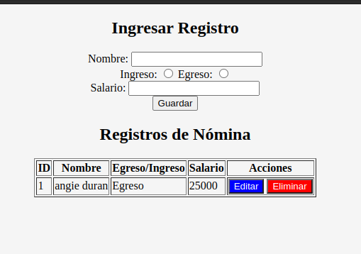
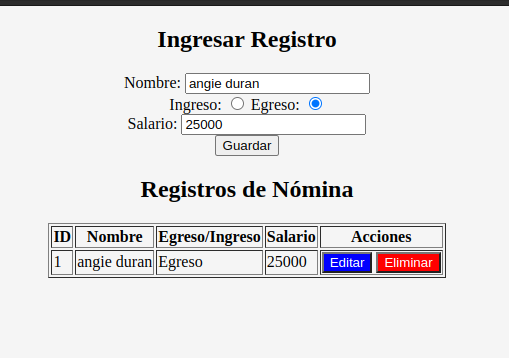

# README - Registro de Nómina Web App

Esta es la documentación para la página web "Registro de Nómina", una aplicación web simple que te permite gestionar registros de nómina. Aquí encontrarás información sobre cómo funciona la página, cómo interactuar con ella y los principales componentes de su código fuente.

# README - Registro de Nómina Web App

Esta es la documentación para la página web "Registro de Nómina", una aplicación web simple que te permite gestionar registros de nómina. Aquí encontrarás información sobre cómo funciona la página, cómo interactuar con ella y los principales componentes de su código fuente.

## Contenido

1. [Introducción](#introducción)
2. [Características](#características)
3. [Instrucciones de Uso](#instrucciones-de-uso)
4. [Estructura del Código](#estructura-del-código)
5. [Recursos Externos](#recursos-externos)
6. [Licencia](#licencia)

## Introducción

La página web "Registro de Nómina" es una herramienta básica para registrar y gestionar información sobre nóminas. Permite agregar, editar y eliminar registros de nómina y muestra los datos en una tabla interactiva.

## Características

- Ingresar un registro de nómina con nombre, tipo de ingreso/egreso y salario.
- Editar registros existentes.
- Eliminar registros de nómina.
- Visualizar los registros en una tabla interactiva.

## Instrucciones de Uso

Para utilizar la aplicación, sigue estos pasos:

1. Clona o descarga el repositorio en tu máquina local.

2. Abre el archivo `index.html` en tu navegador web.

3. Completa el formulario "Ingresar Registro" con los detalles de la nómina, incluyendo nombre, tipo de ingreso/egreso y salario.

4. Haz clic en el botón "Guardar" para agregar un nuevo registro de nómina. El registro aparecerá en la tabla "Registros de Nómina".

5. Para editar un registro existente, haz clic en el botón "Editar" correspondiente al registro que deseas modificar. Los datos del registro se cargarán en el formulario de ingreso.

6. Realiza las ediciones necesarias y haz clic en el botón "Guardar" para actualizar el registro.

7. Para eliminar un registro, haz clic en el botón "Eliminar" correspondiente al registro que deseas eliminar.

8. Los registros se mostrarán en la tabla, y podrás ver su ID, nombre, tipo de ingreso/egreso y salario.

## Estructura del Código

El código fuente de la aplicación se divide en dos partes principales: HTML y JavaScript. A continuación, se presenta una breve descripción de cada archivo:

- `index.html`: Define la estructura HTML de la página web y contiene el formulario de ingreso y la tabla de registros.

- `main.js`: Contiene la lógica de la aplicación, incluyendo la gestión de eventos, las llamadas a la API mock, la creación, edición y eliminación de registros, así como la actualización de la tabla de registros.

- `style.css`: Archivo de hojas de estilo que define la apariencia visual de la página web.

## Como utilizar la aplicacion

Ingresamos a el link https://duranangie.github.io/nomina/ 

1. Se ingresa el nombre de la persona que registra

2. Especifica si es ingreso o engreso.

3. Ingresa el monto a guardar.

4. puede editar o eliminar los datos guardados que aparecen en la tabla dando click en las opciones mencionadas.

bd: https://650a3b71f6553137159c8368.mockapi.io/nomina

## Aplicacion

-crear 

- Editar 

