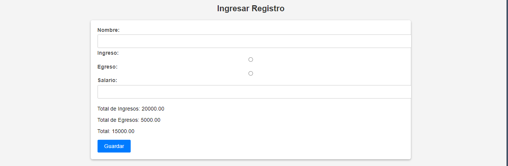
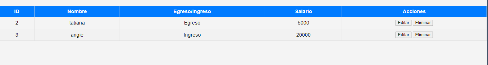
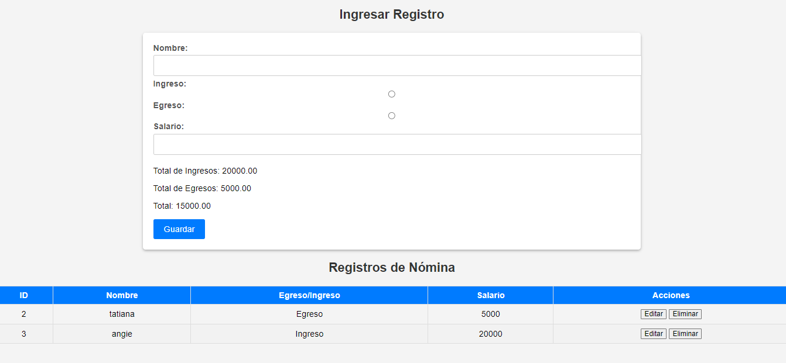

# Registro de Nómina

Este proyecto web permite gestionar registros de nómina a través de una interfaz de usuario. Los registros de nómina se pueden crear, editar y eliminar utilizando una API simulada como backend. El proyecto está implementado en JavaScript y utiliza JSON para la comunicación con la API y el almacenamiento de datos.

## Características Principales

- Crear un nuevo registro de nómina con nombre, tipo (ingreso o egreso) y salario.
- Editar un registro de nómina existente.
- Eliminar registros de nómina.
- Visualizar una lista de registros de nómina en una tabla.

## Configuración

Antes de ejecutar la aplicación, asegúrate de tener [](https://github.com/typicode/json-server) configurado y ejecutándose en `http://localhost:3000/nomina` o actualiza la variable `apiUrl` en el código si tu API está en una ubicación diferente.

## Instalar

Este proyecto es un servidor de nómina construido con Node.js. A continuación, se describen los pasos para instalar y ejecutar el servidor.

## Requisitos previos

Asegúrate de tener las siguientes herramientas instaladas en tu sistema:

- Node.js: Descárgalo e instálalo desde [https://nodejs.org/](https://nodejs.org/)

## Instalación

1. Clona este repositorio en tu máquina local:

   ```bash
   git clone https://github.com/duranangie/nomina.git

2. En la consola ingresa los siguientes comandandos:

   ```bash
   cd nomina


3. ingresa este comando para iniciar el package-lock.json
   ```bash
   npm init -y
   
3. ingresa este comando para descarar la carpeta node_modules

   ```bash
   npm install

  

## Uso

1. Abre el archivo `index.html` en tu navegador web.

2. Utiliza el formulario en la parte superior de la página para crear nuevos registros de nómina. Ingresa el nombre del empleado, selecciona si es un ingreso o egreso, y especifica el salario. Luego, haz clic en "Guardar".

3. Los registros de nómina se mostrarán en la tabla en la parte inferior de la página. Puedes editar o eliminar registros haciendo clic en los botones correspondientes en la tabla.

4. Para editar un registro de nómina, haz clic en el botón "Editar" en la fila del registro que deseas modificar. Los detalles del registro se cargarán en el formulario para su edición.

5. Para eliminar un registro de nómina, haz clic en el botón "Eliminar" en la fila del registro que deseas eliminar. Se te pedirá confirmación antes de eliminar el registro.

## Estructura del Proyecto

- `index.html`: El archivo HTML que define la estructura de la página web y contiene los formularios y tablas.
- `main.js`: El archivo JavaScript que contiene la lógica de la aplicación, incluyendo las funciones para interactuar con la API y actualizar la interfaz de usuario.
- `style.css`: El archivo CSS que define el estilo y diseño de la página web.
- `db.json`: El archivo JSON utilizado como base de datos simulada para almacenar los registros de nómina.

## Contribuciones

Si deseas contribuir a este proyecto, ¡siéntete libre de hacerlo! Puedes enviar solicitudes de extracción (pull requests) para mejoras o correcciones.


## Aplicacion

-crear 



 
-tabla de visualizacion



-pagina completa


